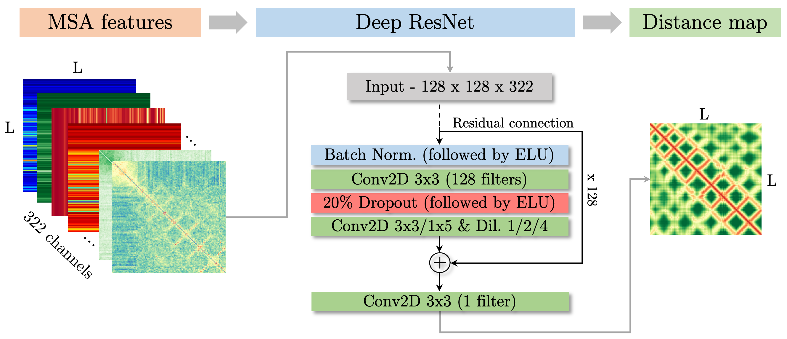

# REALDIST: Real-valued protein distance prediction

Protein structure prediction continues to stand as an unsolved problem in bioinformatics and biomedicine. Deep learning algorithms and the availability of metagenomic sequences have led to the development of new approaches to predict inter-residue distances&mdash;the key intermediate step. Different from the recently successful methods which frame the problem as a multi-class classification problem, this article introduces a real-valued distance prediction method REALDIST. Using a representative set of 43 thousand protein chains, a variant of deep ResNet is trained to predict real-valued distance maps. The contacts derived from the real-valued distance maps predicted by this method, on the most difficult CASP13 free-modeling protein datasets, demonstrate a long-range top-L precision of 52%, which is 17% higher than the top CASP13 predictor Raptor-X and slightly higher than the more recent trRosetta method. Similar improvements are observed on the CAMEO 'hard' and 'very hard' datasets. Three-dimensional (3D) structure prediction guided by real-valued distances reveals that for short proteins the mean accuracy of the 3D models is slightly higher than the top human predictor AlphaFold and server predictor Quark in the CASP13 competition.



## Dependencies
If you already have an alignment (.aln file), following are the dependencies: 
- [x] Tensorflow/Keras
- [x] CCMpred
- [x] Alnstats (from Metapsicov)
- [x] Freecontact

## How to predict?

Get the realdist package (with all scripts and test files)
```
wget https://github.com/ba-lab/realdist/archive/v?.tar.gz
```
Wget the model
```
wget http://deep.cs.umsl.edu/realdist/training-experiments/jobs_pisces_cath.before_CASP14/model-05-28-12-44.hdf5
```
Make prediction
```
./realdist-with-aln.sh ./model-05-28-12-44.hdf5 ./test/1guuA.fasta ./test/1guuA.aln ./test/output/
```

## Datasets/Predictions
http://deep.cs.umsl.edu/realdist/
